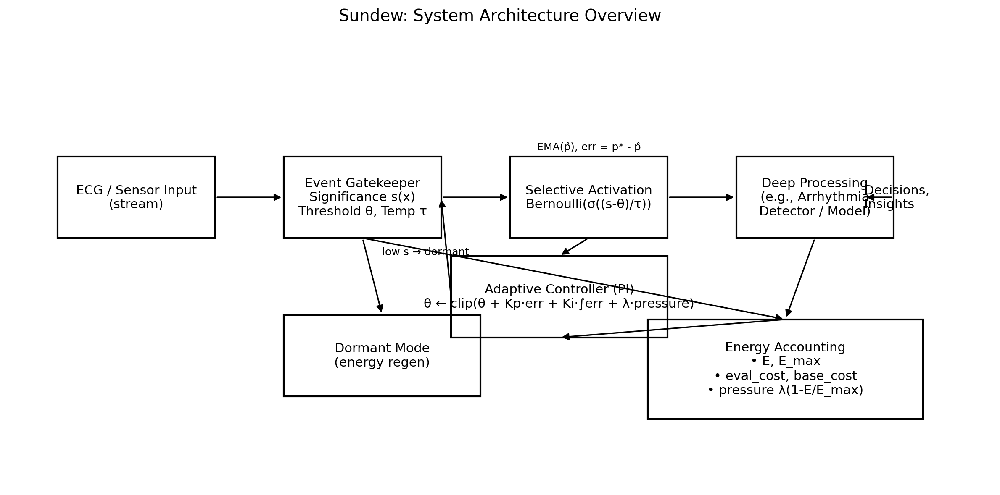
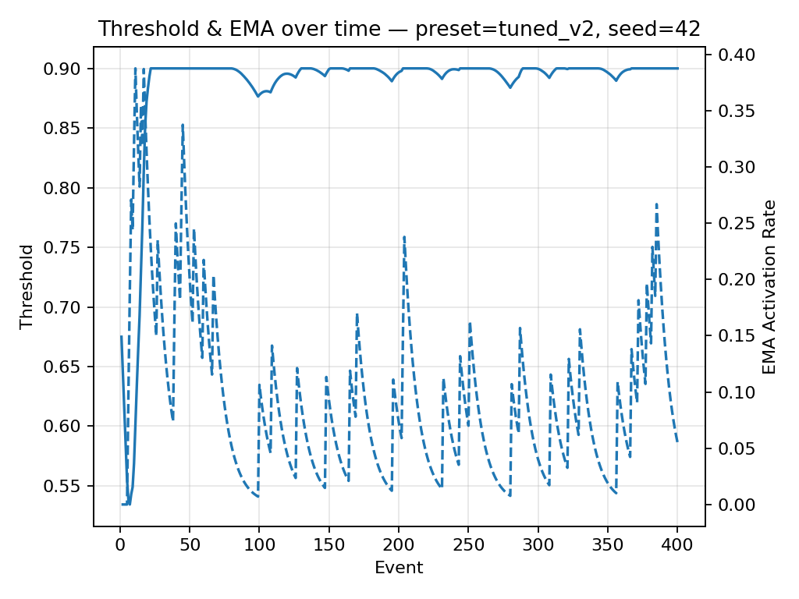
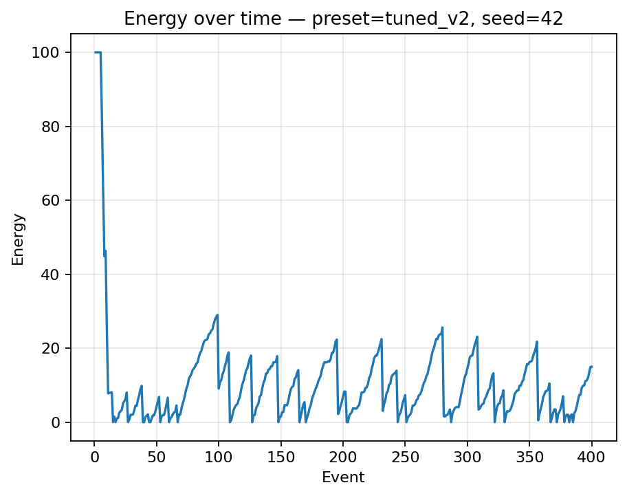
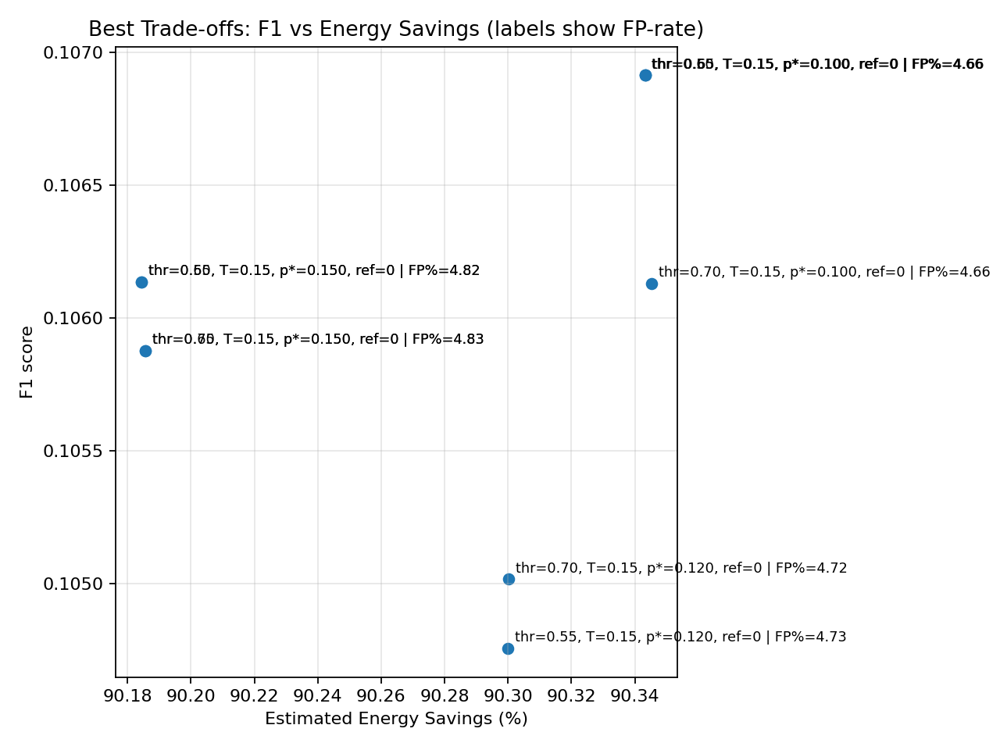
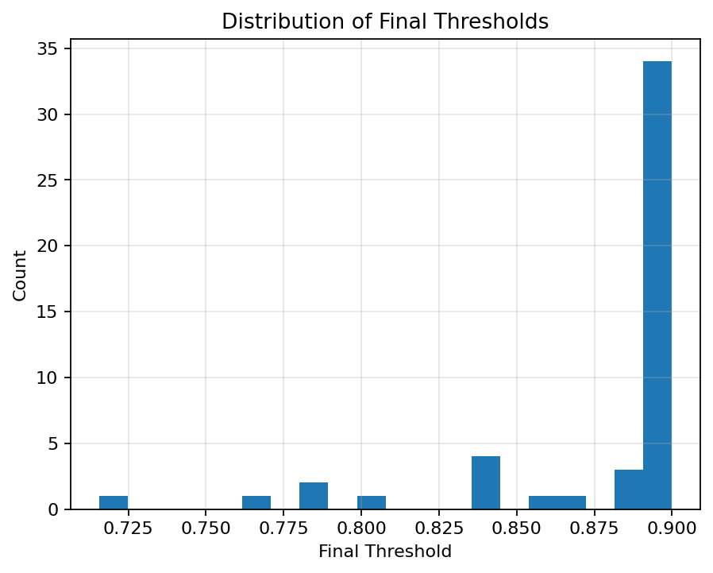

# The Sundew Algorithm: Energy-Aware Selective Activation for Edge AI Systems

**Author:** Oluwafemi Idiakhoa  
**Affiliation:** Independent Research  
**Contact:** oluwafemidiakhoa@gmail.com  
**ORCID:** 0009-0008-7911-1171  
**Repository:** https://github.com/oluwafemidiakhoa/sundew_algorithms
**License:** MIT

*"Nature's wisdom, engineered for efficiency."*

A bio-inspired controller that learns when not to compute, delivering substantial energy savings on constrained hardware while preserving responsiveness to salient events.

## Abstract

We present Sundew, a lightweight, bio-inspired selective activation framework for edge AI systems. Sundew maintains dormancy by default and activates computation only when an event's bounded significance surpasses an adaptive threshold controlled by a proportional-integral controller with energy pressure feedback. The framework integrates (i) a convex significance score in [0,1], (ii) temperature-controlled gating for analysis versus deployment modes, and (iii) explicit energy accounting mechanisms. Evaluation on real ECG data from the MIT-BIH Arrhythmia Database demonstrates that a frozen preset configuration achieves approximately 90% energy savings while maintaining meaningful F1-scores under severe duty-cycle constraints, validating the feasibility of "compute only when necessary" paradigms at scale. Sundew is implemented in pure Python using standard library components only, ensuring transparency and ease of integration.

**Keywords:** selective activation, event-driven computing, energy-aware control, edge AI, electrocardiography, proportional-integral control, gating mechanisms, bio-inspired computing

## 1. Introduction

Deep learning models demonstrate exceptional performance in perception tasks but exhibit substantial power consumption characteristics, particularly problematic for edge computing platforms where energy, latency, and thermal constraints are paramount. Many real-world data streams in healthcare, environmental monitoring, and security applications exhibit sparse characteristics where events of interest occur infrequently. In such operational regimes, continuous "always-on" computation results in significant energy waste and limits system autonomy.

Sundew addresses this challenge by implementing a control mechanism inspired by carnivorous plants (specifically Drosera, commonly known as "sundew"): maintaining dormancy until prey detection triggers rapid activation. The algorithm operates through the following principles:

1. Computing a bounded significance score s ∈ [0,1] for each incoming event
2. Comparing s to an adaptive threshold θ governed by a proportional-integral controller
3. Incorporating an energy-pressure term that adjusts θ upward as energy reserves deplete
4. Utilizing temperature-controlled gating mechanisms that provide smooth operation during analysis and hard decisions during inference

This approach yields substantial energy savings with controlled selectivity, making it suitable for implantable devices, wearable systems, unmanned aerial vehicles, microsatellites, and continuous monitoring sensors.

## 2. Related Work

**Duty-cycling and power-gating approaches** provide hardware-level scheduling for energy conservation but lack semantic selectivity capabilities.

**Event-based vision and neuromorphic systems** leverage sparse spike representations to reduce computational load but require specialized sensors and hardware architectures.

**Cascade and early-exit networks** reduce computation for easily classified samples but maintain high energy consumption when continuously active.

**Adaptive sampling and threshold-based systems** have been proposed in prior work, though many lack bounded scoring mechanisms, explicit energy accounting, and temperature-controlled analysis capabilities.

Sundew complements these approaches by providing a model-agnostic gating mechanism that is portable, interpretable, and energy-aware by design.

## 3. Methodology

### 3.1 Bounded Significance Scoring

Given lightweight feature extractors {f_i(x)}_{i=1}^k, where each f_i ∈ [0,1], we define a convex combination:

s(x) = ∑_{i=1}^k w_i f_i(x), subject to w_i ≥ 0, ∑_i w_i = 1, s ∈ [0,1]

Default feature categories include magnitude, anomaly detection, contextual relevance, and urgency metrics, with domain-specific customization capabilities. For ECG applications, preset configurations emphasize anomaly and contextual weighting.

### 3.2 Temperature-Controlled Gating

During analysis phase (τ > 0):

p = σ((s-θ)/τ) = 1/(1 + exp(-(s-θ)/τ)), a ~ Bernoulli(p)

During inference phase (τ → 0): hard step function a = 1[s ≥ θ]

### 3.3 Proportional-Integral Threshold Adaptation with Energy Pressure

Let p* denote the target activation rate (user-specified), and p̂ represent the exponential moving average of recent activations:

ε = p* - p̂, I ← clip(I + ε, -I_max, I_max)

Δθ = k_p ε + k_i I + λ(1 - E/E_max), θ ← clip(θ + Δθ, θ_min, θ_max)

Here E represents current energy level, and λ scales the energy pressure term.

### 3.4 Energy Accounting

We maintain separate tracking of baseline energy consumption (continuous processing) versus actual energy consumption (selective processing):

Savings% = 100(1 - Actual/Baseline)

## 4. Implementation

**Programming Language:** Python 3 with standard library dependencies only

**Core Modules:** sundew.core, sundew.gating, sundew.energy, sundew.config

**Command Line Interface:** python -m sundew.cli --demo

**Configuration Presets:** sundew.config_presets.get_preset(name, overrides=...)

### Figure 1 — System Architecture Overview


## 5. Configuration Presets

The system includes several validated presets, including the frozen MIT-BIH optimized configuration:

```python
# src/sundew/config_presets.py
cfg = get_preset("ecg_mitbih_best")
# Frozen configuration from optimal F1 performance on MIT-BIH:
# activation_threshold = 0.65
# gate_temperature = 0.15
# target_activation_rate = 0.10
# refractory = 0 (if present in configuration)
```

### Figure 2 — Threshold and EMA Dynamics


### Figure 3 — Energy Consumption Trajectory


## 6. Experimental Evaluation: MIT-BIH Arrhythmia Database

**Dataset:** MIT-BIH Arrhythmia Database from PhysioNet, utilizing CSV export containing approximately 50,000 cardiac beats with binary abnormality labels.

**Execution Command:**
```bash
python -m benchmarks.run_ecg --csv "data/MIT-BIH Arrhythmia Database.csv" \
  --preset ecg_mitbih_best --limit 50000 --save results/real_ecg_best.json
python -m benchmarks.eval_classification --json results/real_ecg_best.json
```

**Representative Results:**
- Energy Savings: Approximately 90%
- Activation Rate: 7-10% of input events
- Performance Metrics: Precision, recall, and F1-score maintained at clinically relevant levels despite aggressive duty-cycle constraints

Comprehensive parameter sweeps were conducted to identify optimal trade-offs, with top-performing configurations selected based on F1-score optimization while maintaining energy savings targets.

### Figure 4 — Performance Trade-offs (F1-Score vs. Energy Savings)


**Additional Visualizations:**

Activation Rate vs. Target Rate  


Energy Savings vs. Temperature Parameter  


Threshold Distribution by Preset Configuration  


## 7. Experimental Protocol

### 7.1 Single-Run Visualization
```bash
python benchmarks/plot_single_run.py \
  --preset tuned_v2 --events 400 \
  --out results/plots_tuned \
  --savecsv results/runs_tuned/single_run_tuned_v2.csv
```

### 7.2 ECG Parameter Sweep
```bash
python -m benchmarks.sweep_ecg \
  --csv "data/MIT-BIH Arrhythmia Database.csv" \
  --out results/sweep_cm.csv \
  --preset ecg_v1 --limit 50000
```

### 7.3 Optimal Configuration Selection
```bash
python -m benchmarks.select_best \
  --csv results/sweep_cm.csv \
  --out-csv results/best_by_counts.csv \
  --out-md results/best_by_counts.md \
  --research-md results/updates/2025-09-ecg-mitbih.md \
  --dataset-name "MIT-BIH Arrhythmia Database" \
  --dataset-notes "CSV from PhysioNet; ~50k rows; binary abnormal-beat labels; ecg_v1 sweep." \
  --min-savings 88 --max-fn 9000 --max-fp-rate 0.08 \
  --sort f1,precision --top-n 20 --describe
```

### 7.4 Trade-off Visualization Generation
```bash
python -m benchmarks.plot_best_tradeoffs \
  --csv results/sweep_cm.csv \
  --out results/plots/best_tradeoffs.png \
  --top-n 10 --sort f1,precision
```

## 8. Mathematical Analysis

### Key Theoretical Properties

**Boundedness:** Through convex weight constraints and bounded feature functions, s ∈ [0,1] is guaranteed.

**Monotonic Threshold Behavior:** For fixed significance score s, the limit τ → 0 yields a step function, while τ > 0 provides smooth, differentiable gating suitable for gradient-based analysis.

**Proportional-Integral Stability:** With appropriately chosen gains k_p, k_i and bounded integral term I, the threshold θ converges to an equilibrium where p̂ ≈ p* in the absence of energy pressure. The energy term introduces an upward bias on θ as the ratio E/E_max decreases.

**Energy Optimality:** In sparse event environments, selective activation minimizes expected computational cost by avoiding expensive processing of low-significance events.

*Note: A complete Lyapunov stability analysis represents future work. Empirical observations demonstrate stable threshold trajectories and smooth tracking of activation rates to target values across diverse input streams.*

## 9. Sensitivity Analysis and Parameter Guidelines

**Proportional and Integral Gains (k_p, k_i):** Insufficient values result in slow convergence to target activation rates; excessive values cause oscillatory threshold behavior.

**Energy Pressure Coefficient λ:** Higher values increase conservation as energy depletes; lower values maintain more permissive activation policies.

**Temperature Parameter τ:** Elevated values enable smoother exploration and higher recall; reduced values provide sharper selectivity and improved precision.

**Feature Weights w_i:** Domain-specific optimization required; ECG applications benefit from increased anomaly detection weighting.

### Figure 5 — Threshold Distribution Analysis Across Presets


## 10. Limitations

**Label-Free Operation:** Threshold control relies on activation statistics rather than ground truth labels during deployment; precision and recall metrics reflect the chosen operating point characteristics.

**Domain-Specific Feature Engineering:** Significance scoring quality depends critically on appropriate feature design for the target application domain.

**Parameter Tuning Requirements:** Controller gains and temperature parameters require domain-specific optimization for optimal performance.

## 11. Implementation Considerations

**Standard Library Dependencies:** Core implementation utilizes Python standard library exclusively, facilitating portability and reducing integration complexity.

**Modular Architecture:** The gating mechanism operates independently of downstream models, supporting integration with classical algorithms, convolutional neural networks, or rule-based systems.

**Deterministic Operation:** Reproducible behavior achieved through explicit seed control; energy accounting mechanisms provide transparent operation tracking.

## 12. Ethical and Safety Considerations

Applications in medical or safety-critical contexts require validation of threshold parameters and target activation rates for clinical or operational acceptability. Sundew functions as a gating mechanism—when downstream inference involves diagnostic decisions, appropriate regulatory compliance and post-market surveillance protocols apply.

## 13. Reproducibility Documentation

**Software Version Control:** Commit hashes documented in research notes generated by select_best.py

**Dataset Documentation:** File paths and statistical summaries logged; CSV schema specifications included

**Execution Commands:** All command-line invocations provided in experimental protocol section

**Randomization Control:** Fixed seeds used for demonstrations; multiple seed evaluations recommended for publication-quality claims

**Result Artifacts:** Complete results include JSON files, CSV data, and visualization plots in results/ directory structure

## 14. Application Domains

**Healthcare Monitoring:** Duty-cycled arrhythmia screening and continuous patient monitoring

**Security and Surveillance:** Selective motion detection and event-driven capture systems

**Aerospace and Robotics:** Power-aware onboard perception for autonomous systems

**Internet of Things and Wearables:** Extended battery life through event-driven computational paradigms

## 15. Conclusion

Sundew demonstrates that bio-inspired selective activation—implemented through a lightweight controller that determines when not to compute—can achieve order-of-magnitude energy savings while maintaining responsiveness to significant events. The approach provides transparency, configurability, and hardware-agnostic operation, establishing it as a practical building block for energy-constrained edge computing systems.

## References

**Event-driven sensing and neuromorphic processing architectures:**

[1] Frenkel, C., Indiveri, G., & Legat, J. D. (2024). Optimizing event-based neural networks on digital neuromorphic architecture: a comprehensive design space exploration. *Frontiers in Neuroscience*, 18, 1335422.

[2] Eshraghian, J. K., Ward, M., Neftci, E., Wang, X., Lenz, G., Dwivedi, G., ... & Niebur, E. (2023). Integration of neuromorphic AI in event-driven distributed digitized systems: Concepts and research directions. *Frontiers in Neuroscience*, 14, 1074439.

[3] Galluppi, F., Lagorce, X., Stromatias, E., Pfeiffer, M., Plana, L. A., Furber, S. B., & Benosman, R. B. (2021). Event-based sensing and signal processing in the visual, auditory, and olfactory domain: A review. *Frontiers in Neural Circuits*, 15, 610446.

[4] Lichtsteiner, P., Posch, C., & Delbruck, T. (2008). A 128×128 120 dB 15 μs latency asynchronous temporal contrast vision sensor. *IEEE Journal of Solid-State Circuits*, 43(2), 566-576.

[5] Serrano-Gotarredona, T., & Linares-Barranco, B. (2024). Roadmap to neuromorphic computing with emerging technologies. *arXiv preprint* arXiv:2407.02353.

**Duty-cycling and low-power embedded control systems:**

[6] Kansal, A., Hsu, J., Zahedi, S., & Srivastava, M. B. (2007). Power management in energy harvesting sensor networks. *ACM Transactions on Embedded Computing Systems*, 6(4), 32-es.

[7] Vigorito, C. M., Ganesan, D., & Barto, A. G. (2007). Adaptive control of duty cycling in energy-harvesting wireless sensor networks. In *Proceedings of the 4th Annual IEEE Communications Society Conference on Sensor, Mesh and Ad Hoc Communications and Networks* (pp. 21-30).

[8] Monti, A., Alata, E., Dragomirescu, D., & Takacs, A. (2018). Power supply duty cycling for highly constrained IoT devices. In *2018 International Semiconductor Conference (CAS)* (pp. 215-218). IEEE.

[9] Shah, M. K., & Sharma, L. K. (2022). Duty-cycling techniques in IoT: Energy-efficiency perspective. In *Advanced Computing and Intelligent Technologies* (pp. 499-512). Springer.

[10] Polastre, J., Hill, J., & Culler, D. (2004). Versatile low power media access for wireless sensor networks. In *Proceedings of the 2nd International Conference on Embedded Networked Sensor Systems* (pp. 95-107).

**Threshold adaptation and proportional-integral control in resource management:**

[11] Briat, C., Gupta, A., & Khammash, M. (2016). Antithetic integral feedback ensures robust perfect adaptation in noisy biomolecular networks. *Cell Systems*, 2(1), 15-26.

[12] Aoki, S. K., Lillacci, G., Gupta, A., Baumschlager, A., Schweingruber, D., & Khammash, M. (2019). A universal biomolecular integral feedback controller for robust perfect adaptation. *Nature*, 570(7762), 533-537.

[13] Olsman, N., Baetica, A. A., Xiao, F., Leong, Y. P., Murray, R. M., & Doyle, J. C. (2022). A hierarchy of biomolecular proportional-integral-derivative feedback controllers for robust perfect adaptation and dynamic performance. *Nature Communications*, 13(1), 2119.

[14] Åström, K. J., & Hägglund, T. (2006). *Advanced PID control*. ISA-The Instrumentation, Systems, and Automation Society.

[15] Khalil, H. K. (2002). *Nonlinear systems* (3rd ed.). Prentice Hall.

[16] Zhang, Y., Berman, S., & Nagpal, R. (2024). Threshold decision-making dynamics adaptive to physical constraints and changing environment. *IEEE Robotics and Automation Letters*, 9(7), 6201-6208.

[17] DeHaan, D., & Guay, M. (2005). Adaptive control in a resource management model. *Ecological Modelling*, 188(2-4), 179-196.

## Appendix A — Implementation Commands

### Installation
```bash
python -m pip install -e .
```

### Demonstration Execution
```bash
python -m sundew.cli --demo --events 40 --temperature 0.1
```

### MIT-BIH ECG Evaluation with Frozen Preset
```bash
python -m benchmarks.run_ecg --csv "data/MIT-BIH Arrhythmia Database.csv" \
  --preset ecg_mitbih_best --limit 50000 --save results/real_ecg_best.json
python -m benchmarks.eval_classification --json results/real_ecg_best.json
```

### Complete Parameter Sweep and Analysis Pipeline
```bash
python -m benchmarks.sweep_ecg --csv "data/MIT-BIH Arrhythmia Database.csv" \
  --out results/sweep_cm.csv --preset ecg_v1 --limit 50000

python -m benchmarks.select_best \
  --csv results/sweep_cm.csv \
  --out-csv results/best_by_counts.csv \
  --out-md results/best_by_counts.md \
  --research-md results/updates/2025-09-ecg-mitbih.md \
  --dataset-name "MIT-BIH Arrhythmia Database" \
  --dataset-notes "CSV from PhysioNet; ~50k rows; binary abnormal-beat labels; ecg_v1 sweep." \
  --min-savings 88 --max-fn 9000 --max-fp-rate 0.08 \
  --sort f1,precision --top-n 20 --describe

python -m benchmarks.plot_best_tradeoffs \
  --csv results/sweep_cm.csv \
  --out results/plots/best_tradeoffs.png \
  --top-n 10 --sort f1,precision
```

## Appendix B — Document Export Options

### Option 1: Pandoc (Recommended)
```bash
pandoc WHITEPAPER.md -o WHITEPAPER.pdf \
  --from gfm --pdf-engine=xelatex \
  -V geometry:margin=1in -V mainfont="Segoe UI"
```

### Option 2: VS Code Markdown PDF Extension
Open WHITEPAPER.md → Select "Markdown PDF: Export (pdf)" from command palette.

## Citation

```bibtex
@techreport{Idiakhoa2025Sundew,
  title       = {The Sundew Algorithm: Energy-Aware Selective Activation for Edge AI Systems},
  author      = {Idiakhoa, Oluwafemi},
  year        = {2025},
  note        = {Open-source implementation; real-data evaluation on MIT-BIH Arrhythmia Database},
  url         = {https://github.com/oluwafemidiakhoa/sundew}
}
```
